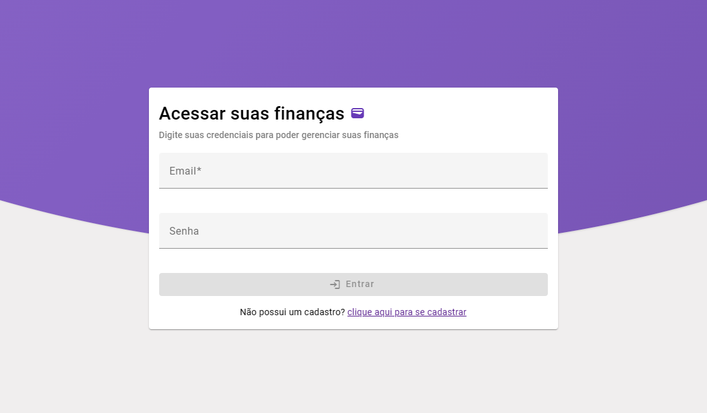
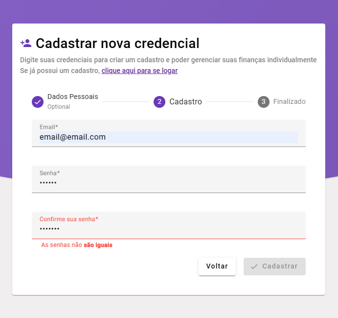

# Projeto Angular Minhas Finanças 💳

Repositório de estudo sobre o Angular 16, foi criado uma aplicação no modelo de CRUD (Create, Read, Update, Delete) para administrar entradas de despesas e receitas do usuário.

O Projeto foi desenvolvido utilizando o HTTP Cliente nativo do Angular para lidar com requisições HTTP, foi usado o Reactive Forms para trabalhar com formulários de modo reativo

    <kbd>
        
    </kbd>

    <kbd>
        
    </kbd>

    <kbd>
        
    </kbd>

## 🔮 Tecnologias

- Angular 15
- Angular Material
- DayJs
- NG2 Chart (chart.js - biblioteca de gráfico - para o Angular)
- ~~json server para um servidor simples em json (`db.json`)~~
  - Substituição de servidor RESP API fictício de json-server para o programa Mockoon

## 🧱 Features

- Utilização do gráfico da biblioteca NG2 para a página de Dashboard
- Utilização do **HTTP Client** e **Observables** do Angular para requisições HTTP
- Utilização do **Angular Material** para estilização nativa do Angular
- Servidor REST API fictício com o Mockoon para a aplicação
- Filtragem na tabela de Entradas utilizando **Reactive Forms**

## Abrir a aplicação no ambiente de desenvolvimento

- Baixe as dependências com o comando `npm install`
- Use a CLI do Angular para iniciar a aplicação com o comando `ng serve`
- Usa-se o programa Mockoon para servir como servidor REST para a aplicação, para isso abra o **environment** `minhasfinancias-mockoon.json` que está nesse repositório dentro do programa Mockoon
  - Para a autenticação dentro da aplicação usa-se o login `brendon@email.com` e a senha `1234`
  - A funcionalidade de cadastro ainda não está implementada nesta aplicação

## 🖼 Imagens da Aplicação

## Página de Login

    <kbd>
        
    </kbd>

    <kbd>
        
    </kbd>

    <kbd>
        
    </kbd>

### Página de Dashboard

    <kbd>
        
    </kbd>

### Página de Categorias

    <kbd>
        
    </kbd>

    <kbd>
        
    </kbd>

### Página de Entradas

    <kbd>
        
    </kbd>

    <kbd>
        
    </kbd>

    <kbd>
        
    </kbd>

    <kbd>
        
    </kbd>

    <kbd>
        
    </kbd>

## Página de erro 404 (Quando a rota não é encontrada)

    <kbd>
        
    </kbd>

