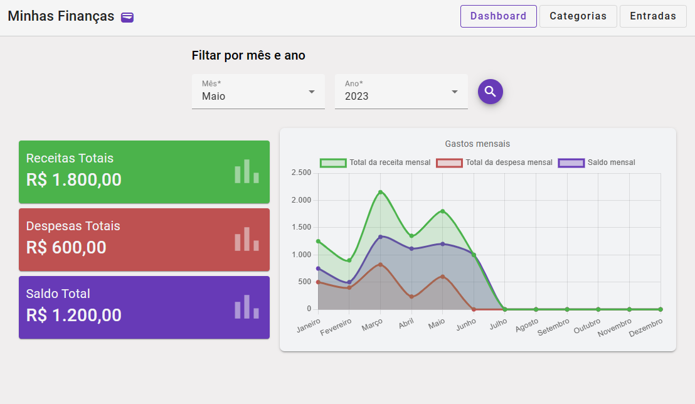
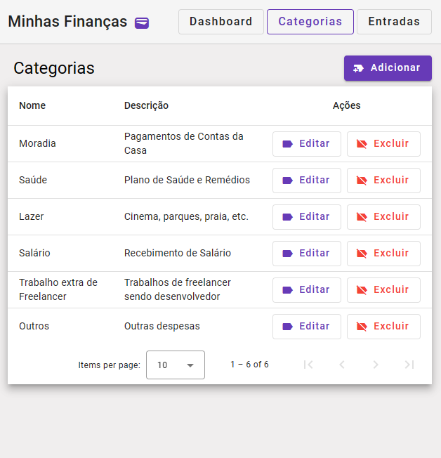
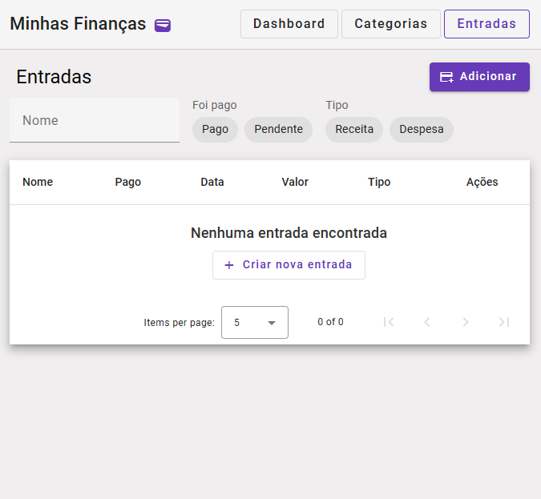
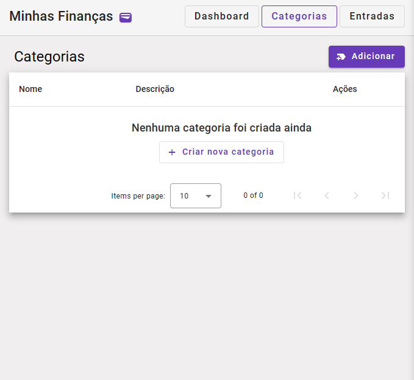
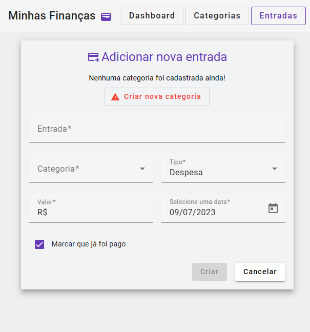
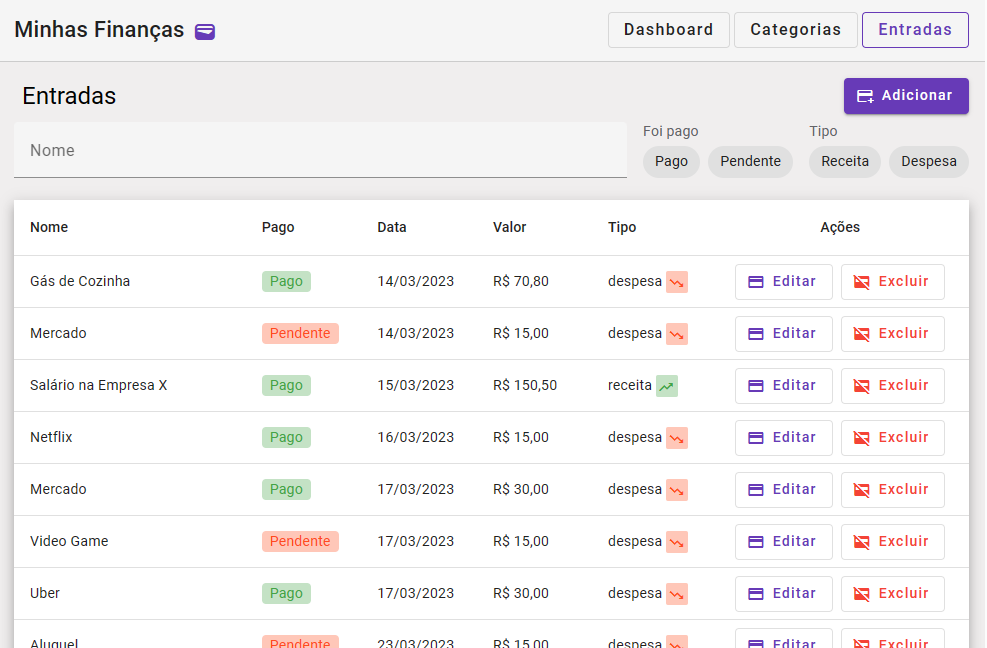
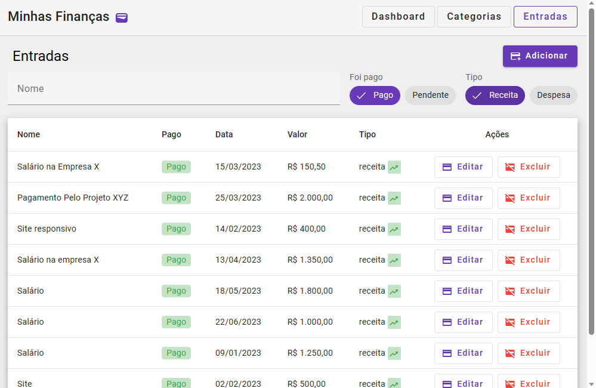
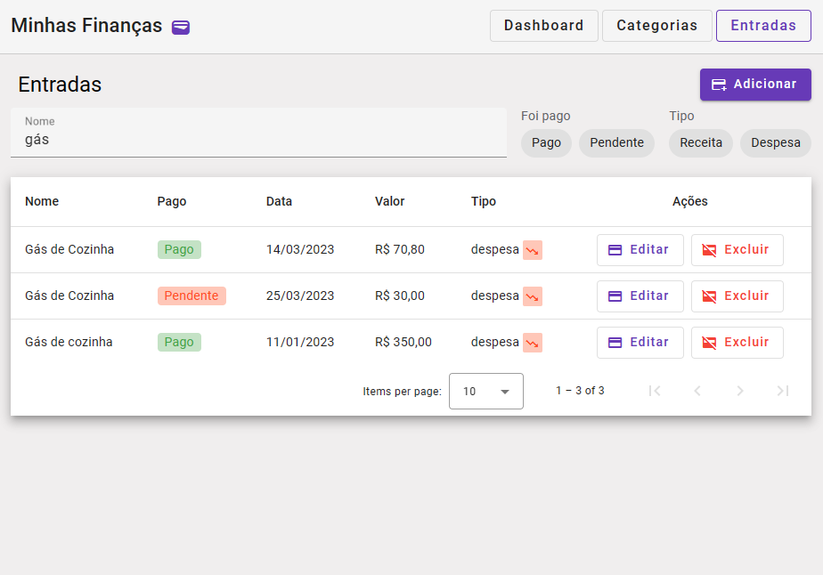

# Projeto Angular Minhas Finanças 💳

Repositório de estudo sobre o Angular 16, foi criado uma aplicação no modelo de CRUD (Create, Read, Update, Delete) para administrar entradas de despesas e receitas do usuário.

O Projeto foi desenvolvido utilizando o HTTP Cliente nativo do Angular para lidar com requisições HTTP, foi usado o Reactive Forms para trabalhar com formulários de modo reativo

    <kbd>
        
    </kbd>

    <kbd>
        
    </kbd>

    <kbd>
        
    </kbd>

## 🔮 Tecnologias

- Angular 15
- Angular Material
- DayJs
- NG2 Chart (chart.js - biblioteca de gráfico - para o Angular)
- json server para um servidor simples em json (`db.json`)

## 🧱 Features

- Utilização do gráfico da biblioteca NG2 para a página de Dashboard
- Utilização do **HTTP Client** e **Observables** do Angular para requisições HTTP
- Utilização do **Angular Material** para estilização nativa do Angular
- Servidor **json-server** para a plicação
- Filtragem na tabela de Entradas utilizando **Reactive Forms**

## Servidor no ambiente de desenvolvimento

Baixe as dependências com o `npm install`

Deixe rodando em um terminal a parte o servidor do **json-server**, usando o comando `npm run server`

Execute o comando `ng serve` para iniciar o servidor Angular no ambiente de desenvolvimento. Depois abra a seguinte URL `http://localhost:4200/` para testar aplicação.

## Outros comandos (em Inglês)

### Build

Run `ng build` to build the project. The build artifacts will be stored in the `dist/` directory.

### Executando testes unitários (unit tests)

Run `ng test` to execute the unit tests via [Karma](https://karma-runner.github.io).

### Rodando testes end-to-end

Run `ng e2e` to execute the end-to-end tests via a platform of your choice. To use this command, you need to first add a package that implements end-to-end testing capabilities.

### Ajuda na aplicação do Angular

To get more help on the Angular CLI use `ng help` or go check out the [Angular CLI Overview and Command Reference](https://angular.io/cli) page.

## 🖼 Imagens da Aplicação

### Página de Dashboard

    <kbd>
        
    </kbd>

### Página de Categorias

    <kbd>
        
    </kbd>

    <kbd>
        
    </kbd>

### Página de Entradas

    <kbd>
        
    </kbd>

    <kbd>
        
    </kbd>

    <kbd>
        
    </kbd>

    <kbd>
        
    </kbd>

    <kbd>
        
    </kbd>

## Página de erro 404 (Quando a rota não é encontrada)

    <kbd>
        
    </kbd>

